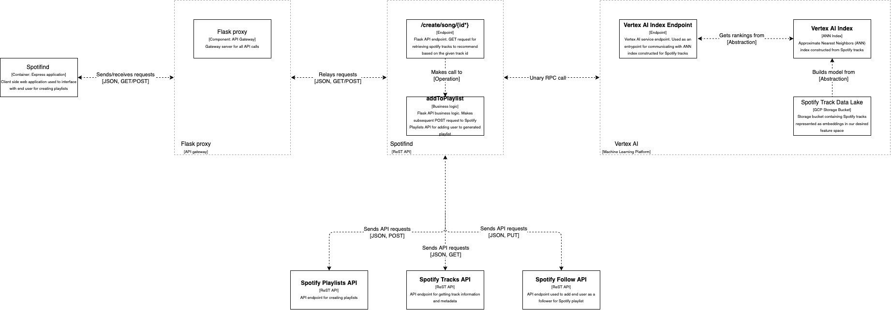

# Spotifind REST API
REST API for recommending tracks and creating playlists on Spotify.

## Overview
Spotifind is a REST web service that provides the ability to provide any number of Spotify track recommendations based on any available input track.

### How the recommendations work

(This is not needed to interface with the API, but it's an interesting read if you like machine learning, linear algebra, or distributed systems)

We motivate understanding by the following constraints imposed on our API:
- **No end user context**: We assume that we have no understanding of the end user's likes and dislikes. This cannot be exploited for incoming requests.
- **Recommendations on demand**: Recommendations need to be determined on-demand when an input track is received by calling clients. It consequently needs to adopt a low-latency strategy.

For the first contraint imposed above, in order to make recommendations, our API exploits a [content-based filtering](https://developers.google.com/machine-learning/recommendation/content-based/basics) machine learning strategy, where Spotify track recommendations are made based on the affinity to the input track. With respect to the second contraint, a nearest neighbors strategy naturally evolves from the need to provide recommendations on demand. Since we wish for recommendations to remain low-latent as the possible track recommendations scale, it uses [Vertex AI Matching Engine](https://cloud.google.com/vertex-ai/docs/matching-engine/overview); this allows our API to provide low-latency response times for any number of requested recommendations at a high scale.


Below is the current iteration for the system architecture. The core components are outlined as follows:
- The recommender system sits behind the REST API which calling clients interface with. The resource on this API used to get recommendations is `/v1/reco/{id*}`, where **id** denotes the input Spotify track ID.
- The recommender system downstream is contained inside of a [gRPC](https://grpc.io/) web service. A data lake is created containing Spotify track IDs and corresponding features from the Spotify [audio features](https://developer.spotify.com/console/get-audio-features-track/) API (liveness, tempo, danceability, etc.) with roughly 100,000 songs. Using these features, a special kind of vector space called a [feature space](https://pages.cs.wisc.edu/~bsettles/cs540/lectures/16_feature_spaces.pdf) is created containing an embedding (representation) of all Spotify tracks used for recommendation output. This data lake is used by the Vertex AI machine learning platform to build an index that is needed for low-latent nearest neighbors searches.
- For input songs, the [client credentials flow](https://developer.spotify.com/documentation/general/guides/authorization/client-credentials/) is used for authentication: a call to Spotify's `/api/token` API is made first, with a sequential service call being made to the Spotify [audio features](https://developer.spotify.com/console/get-audio-features-track/) API in order to embed the input song into our feature space. From here, our gRPC service takes this track embedding as input and returns the nearest neighbors as track embeddings for the recommended songs.

[](specs/diagrams/architecture/component_diagram.drawio.png)

## API Documentation
Spotifind is a REST web service. Any HTTP client can be used in order to interface with the API. A Postman collection for the existing resources can be found [here](https://www.getpostman.com/collections/3227a5bf7a781f5bfd65).

### Endpoints
Spotifind API is exposed behind two endpoints:

1. **34.160.143.178 (external IP)**: This is our external IP currently configured in Google Cloud for edge routing (this is prone to change since we have not yet configured a domain). This is currently deployed in the [us-west1-c zone](https://cloud.google.com/compute/docs/regions-zones).
2. **localhost (loopback address)**: This is used during development on a local machine.

### Resources

#### /v1/reco/{id*}
| Resource  | Description | Type | Parameters |
| ------------- | ------------- | ------------- | ------------- |
| /v1/reco/{id*}  | Retrieve Spotify tracks to recommend based on the given track id | GET | **id** - Spotify Track ID to use when generating playlist <br> **size** - Size of the playlist to generate. Default size 10 | 

##### HTTP response status codes
| Status code | Description |
| ------------- | ------------- |
| 200  | When track id recommendations are returned successfully |
| 400  | Miscellaneous client failure |
| 404  | Client failure due to invalid track id |
| 500  | Miscellaneous service failure |

### Example Usage
Request:
```
GET::{{host}}/v1/reco/2TRu7dMps7cVKOyazkj9Fb?size=5
```
Response:
```
{
    "recos": [
        {
            "id": "4JnCD65HeEbeTumgu6xEl3"
        },
        {
            "id": "0iCxoVGB01iGIBgyFgovyt"
        },
        {
            "id": "72rc5PamxGNcNcFMBkZosp"
        },
        {
            "id": "6VGGUt2yqHqrEnEeKrIkJM"
        },
        {
            "id": "4HpsRlpQ7Rj70Jo2d0yYBV"
        }
    ],
    "request": {
        "size": "5",
        "track": {
            "id": "2TRu7dMps7cVKOyazkj9Fb"
        }
    }
}
```

## Contributions

### Getting started

#### Installation

#### Development

#### Testing


